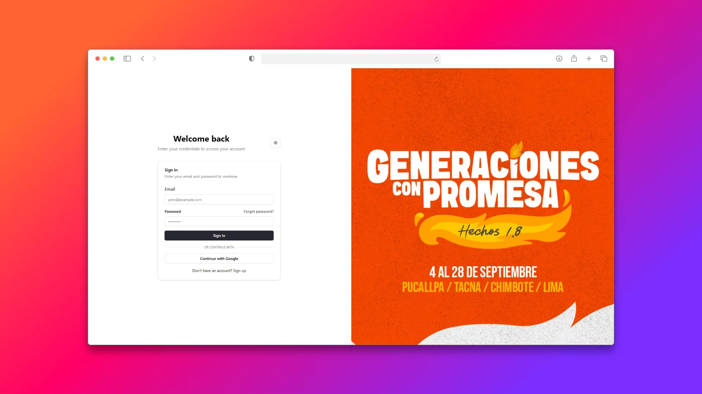

# 🗓️ Sistema de Gestión de Eventos



Un sistema web creado para gestionar eventos comunitarios, registrar participantes y controlar pagos. Inspirado en una necesidad real detectada en mi iglesia, este proyecto me permitió aprender nuevas tecnologías mientras resolvía un problema concreto.

> _"Si las empresas aún no quieren contratarme, entonces haré que quieran contratarme."_

---

## 🚀 Funcionalidades principales

- Creación y gestión de eventos
- Registro de participantes
- Gestión de pagos
- Login seguro y flujo de autenticación
- Interfaz intuitiva y responsive

---

## 🛠️ Stack Tecnológico

### Frontend:
- React
- React Router
- TypeScript
- TailwindCSS
- React Hook Form + Yup
- Zustand
- Axios
- Lucide React
- React Toastify
- Shadcn UI

### Backend:
- NestJS
- TypeORM
- MySQL
- Docker Compose
- bcryptjs
- JWT (nest-jwt)
- dotenv
- class-validator / class-transformer

### Herramientas:
- Postman
- HeidiSQL

---

## 📦 Instalación

### 1. Clonar el repositorio
```bash
git clone https://github.com/Pedrosandoval2/Event-Registration-System
cd Event-Registration-System
```
### 2.- Clonar el Backend
```bash
git clone https://github.com/Pedrosandoval2/back_form_app
cd back_form_app

cp .env.example .env
# Asegúrate de llenar tus variables de entorno correctamente

# Levanta los servicios con Docker
docker-compose up --build
