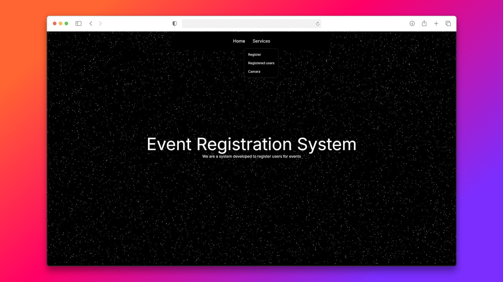

# 📋 Sistema de Registro de Asistentes con QR



Sistema de registro y control de asistencia para eventos.  
Permite simular el registro (auto-registro o registro desde admin), ver la lista de asistentes, generar un QR por asistente y escanearlo desde una vista para validar/consultar al backend. Si el QR escaneado no corresponde a ningún usuario, el backend responde indicando que no existe.

---

## 🔎 Flujo general

1. El organizador o el usuario registra a una persona (simulación o auto-registro).
2. En la lista de asistentes aparece cada usuario con un botón **Generar QR**.
3. El backend genera un QR con un identificador (por ejemplo `attendeeId` o un token corto).
4. En la vista de escaneo (scanner), se escanea el QR con `html5-qrcode`.
5. El frontend envía el contenido del QR al backend para consulta.
6. Si existe el usuario, se retorna la info y se puede marcar asistencia; si no existe, el backend responde `404` o `{ message: "Usuario no encontrado" }`.

---

## 🧩 Stack (ejemplo)

**Backend:** NestJS, TypeScript, TypeORM, MySQL (docker-compose), `qrcode`, class-validator, class-transformer, JWT (opcional).  
**Frontend:** Next.js, `html5-qrcode`, TailwindCSS, Axios.  
**Infra / Dev:** Docker Compose para DB y servicios, Postman para pruebas.

---

## 🚀 Endpoints (ejemplo - Backend)

### `POST /attendees` — Registrar asistente (simulación / auto-registro)
**Request**
```json
{
  "name": "Juan Perez",
  "email": "juan@ejemplo.com",
  "phone": "987654321"
}
